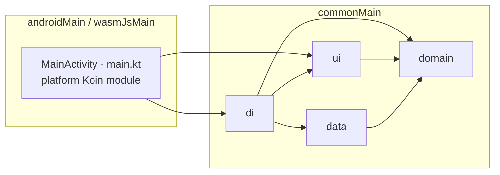

# Wird architecture

How the code is laid out, which way dependencies point, and how to add a feature without
asking anyone. The operating contract — git workflow, delegation, review — is in
[CLAUDE.md](CLAUDE.md); this document is the map.

Wird is one Compose Multiplatform module, `:composeApp`, targeting **Android (minSdk 26)**
and **wasmJs** (the browser). Everything shared lives in `commonMain`. A target contributes
only its entry point and the pieces that genuinely cannot be shared: the Room database
builder (Android needs a `Context`, the browser needs a Web Worker) and nothing else.

## Layout

```
composeApp/src/
  commonMain/kotlin/dev/ahmad/wird/
    domain/
      model/        pure data classes, no annotations
      repository/   repository INTERFACES only
      usecase/      one class per use case, one operator fun invoke
      util/         pure helpers (week boundaries, date arithmetic, the JSON export encoder)
    data/
      local/        Room entities, DAOs, WirdDatabase, migrations, LocalTransaction
      mapper/       entity <-> domain model
      remote/       remote sources (today: the seeded FakeCircleRepository)
      repository/   repository IMPLEMENTATIONS of the domain interfaces, OutboxWriter
    ui/
      theme/        tokens: colours, spacing, radii, sizes; WirdTheme
      components/   reusable stateless composables
      base/         BaseViewModel, BaseInteractionListener, EffectHandler
      format/       NumeralFormatter, the one place numbers become text
      navigation/   routes, bottom-bar destinations, the nav graph
      feature/      one package per screen
    di/             one Koin module per layer, plus initKoin
  androidMain/      MainActivity, WirdApplication, androidPlatformModule
  wasmJsMain/       main.kt, wasmPlatformModule, the SQLite worker and WASM binary
  commonTest/       domain and ViewModel tests, fakes under domain/fake
  androidUnitTest/  tests that need real SQLite: DAOs, repositories, migrations
buildSrc/           the domain layering detector and its tests
```

## Which way dependencies point



Every arrow means "may import". Nothing points out of `domain`, and nothing points from
`ui` to `data` or from `data` to `ui`:

| Layer | May depend on | Must never depend on |
| --- | --- | --- |
| `domain` | Kotlin stdlib, kotlinx-datetime, kotlinx-coroutines, itself | `data`, `ui`, `di`, Compose, Room, Koin, Supabase, Android, serialization — anything else |
| `data` | `domain`, Room, kotlinx-serialization, platform drivers | `ui` |
| `ui` | `domain` (models and use cases), Compose, Koin's ViewModel helpers | `data` — a screen reaches storage only through a use case, which reaches it only through a repository interface |
| `di` | everything, because wiring is its only job | — |

### How the domain rule is enforced

`:composeApp:checkDomainPurity` reads every `.kt` file under `domain/` and fails the build on
anything outside the allowlist in `composeApp/build.gradle.kts`. It is wired to every Kotlin
compilation, so `assembleDebug` and `wasmJsBrowserDistribution` both stop at a violation;
you cannot build the app with one. It judges:

- every **import** against the allowlist;
- every **type written with its package inline** (`java.util.UUID`, `dev.ahmad.wird.data.local.HabitEntity`) against the same allowlist — an inline name carries no import line;
- names escaped in **backticks**, after unescaping them.

Comment and KDoc lines are skipped. The detector lives in `buildSrc`
(`dev.ahmad.wird.gradle.DomainPurity`) and is unit tested there
(`./gradlew -p buildSrc test`). Its behaviour has been confirmed by planting real violations
in a domain file; each one stopped the build. Widening the allowlist is an architecture
decision, never a convenience.

The other rules — no repository in a ViewModel, no entity reaching the UI, tokens only in
features — are held by review, not by a tool.

## The domain

- **Models** are plain data classes that validate themselves in `init` and carry no
  annotations and no display text.
- **Habits are effective-dated.** A habit's `id` is shared by every revision; each revision
  has `effectiveFrom` (inclusive) and `retiredOn` (exclusive). Editing a target closes the
  open revision and opens a new one from today, so past days keep the target they had.
  Deactivating retires the open revision from today. Reactivating carries the newest
  revision forward from the day it returns; the days it was off stay off.
- **`DaySnapshot` is the unit of scoring**: one day, the revisions live that day, and what was
  recorded. Everything that scores reads `scheduledHabits`, never "today's habits".
- **One rule for "done":** `Habit.isKeptBy(value)` — at or past the target. Nothing else
  compares a value to a target.
- **Today** comes from an injected `Clock` and `TimeZone`, never from a ViewModel, and
  `ObserveTodayUseCase` turns over at each midnight in the zone. The wait for midnight runs on
  real time (its injectable `timer`), so a test that drains a virtual-time scheduler never
  spins on a timer that re-arms itself every day; only the rollover tests pass a test
  dispatcher. Entries keep the day they were written with, so crossing a timezone never moves
  one.
- **Weeks run Saturday to Friday** (`WeekBoundary`).
- **Use cases** are one class with one `operator fun invoke`. A use case that only reads
  returns a `Flow`; one that writes is `suspend`. Shared internal helpers that several use
  cases need (such as `observeSnapshots` in `DayScores.kt`) stay `internal`.

## The data layer

- **Entities never leave `data/`.** A mapper converts at the edge, and unknown stored enum
  values read back as the fresh-install default rather than failing.
- **Local-first.** Every write completes against the local database and returns; nothing
  awaits a network.
- **Every write is atomic with its outbox record.** Repositories run each write — including
  any read it depends on — inside `LocalTransaction.write { }`, an immediate Room transaction.
  The outbox (`OutboxWriter`) is the ordered log a future sync layer will replay, so a row
  and its record land together or not at all. Nothing drains the outbox yet.
- **Row ids are client-generated UUIDs**, and a repository reuses a stored row's id on
  rewrite, so a row keeps one identity for its whole life.
- **Every observation is `seededWith` a suspend read.** On wasmJs a Room `Flow` did not deliver
  its initial value; the seed makes the first emission come from a real read. No JVM test can
  show the defect, so do not remove it.
- **Migrations are real and never destructive by accident.** There is no
  `fallbackToDestructiveMigration`. Each version's schema is exported to `composeApp/schemas/`,
  each migration copies its SQL from that export, and `WirdMigrationTest` opens a database
  written at every earlier version and lets Room's validator judge the result.

## The UI layer

- **Tokens only.** Features and components take every colour, spacing, radius and size from
  `ui/theme` (`WirdLightColors` / `WirdDarkColors`, `Spacing`, `Radius`, `Sizes`). A value that is
  missing becomes a token first. The current tokens are placeholders until the design board is
  extracted.
- **RTL is forced** app-wide in `WirdTheme`, whatever the host locale. Lay out with start/end,
  never left/right.
- **Minimum touch target 48dp** (`Sizes.minTouchTarget`); `WirdListRow` enforces it.
- **No English in the UI.** Every visible string lives in a feature's `Labels` file or next to
  the destination it names.
- **Numbers become text in one place,** `NumeralFormatter`, so the Western / Arabic-Indic
  setting switches every number at once. User-typed text never goes through it.
- **`NavController` stays in `ui/navigation`.** Screens receive lambdas.

## The feature pattern

A feature is one package under `ui/feature/<name>/` with exactly these files:

| File | Holds |
| --- | --- |
| `<Name>UiState.kt` | one `@Immutable data class <Name>UiState` with display-ready values only (every number already formatted, no domain model inside), any row or item states, and `sealed interface <Name>Effect` |
| `<Name>InteractionListener.kt` | `interface <Name>InteractionListener : BaseInteractionListener` — every interaction the screen has, in one place |
| `<Name>ViewModel.kt` | `class <Name>ViewModel(...) : BaseViewModel<<Name>UiState, <Name>Effect>(...), <Name>InteractionListener` |
| `<Name>Screen.kt` | the stateful `<Name>Screen()` — `koinViewModel()`, `collectAsStateWithLifecycle()`, `EffectHandler` — and a **private, stateless** `<Name>Content(state, listener, ...)` |
| `<Name>Labels.kt` | the Arabic strings and the formatting that turns state into text |

and its tests, in `commonTest/.../ui/feature/<name>/`, driving the ViewModel through the
in-memory fakes.

Rules that go with it:

- **State vs effect.** Anything the screen must still show after a rotation — loading, an
  error message, the rows — is state. Only one-shot events (a snackbar message, a navigation)
  are effects. Effects travel on a channel, so each is delivered exactly once and never
  replayed.
- **The ViewModel calls use cases only.** No repository, no DAO, no scoring, no date
  arithmetic, no completion rule; it maps domain results to display-ready state.
- **`MutableStateFlow`, never `mutableStateOf`,** inside a ViewModel — `BaseViewModel` already
  holds it; use `updateState { }`.
- **`Content` never touches a ViewModel** and takes a single listener, not a drift of lambdas,
  so it can be previewed and tested alone.
- **Failure paths** go through `tryToExecute` and `collectFlow`, which rethrow cancellation and
  route everything else to `onError`.

### Adding a feature, step by step

1. Write or reuse the **use cases** it needs, in `domain/usecase`, test first against the fakes
   in `commonTest/.../domain/fake`. Register each in `di/DomainModule.kt`.
2. Create `ui/feature/<name>/` with the five files above. Start from `UiState` and the
   listener: they are the contract everything else is written against.
3. Write the **ViewModel test** first: build the ViewModel over fakes, drive it through the
   listener, and assert on `state` and `effect`.
4. Implement the ViewModel, then the Screen and its private `Content`, using tokens and
   components only.
5. Register the ViewModel in `di/UiModule.kt` and add the route to `ui/navigation/Routes.kt`
   and `WirdNavGraph.kt` (and to `TopLevelDestination` if it belongs in the bottom bar).
6. Run the gates:

   ```bash
   ./gradlew :composeApp:testDebugUnitTest
   ./gradlew :composeApp:checkDomainPurity
   ./gradlew :composeApp:assembleDebug
   ./gradlew :composeApp:wasmJsBrowserDistribution
   ```

## Testing

- **Fakes are real in-memory implementations,** not mocks (`FakeHabitRepository`,
  `FakeEntryRepository`, `FakeSettingsRepository`). They mirror the real repositories' rules —
  revisions, reinstatement, all-or-nothing `upsertAll` — so a test that passes on a fake means
  the same thing against Room. `FakeControls` makes one slow or makes it fail: the next call,
  every call, or after a number of calls.
- **Anything that needs SQL** runs in `androidUnitTest` against `createTestDatabase()`, a real
  in-memory Room database on the bundled SQLite driver.
- **Tests come first** and are watched failing for the right reason. A change is not finished
  until a deliberate break of the code it protects (a mutation) makes at least one test fail.
- **Time** is injected: tests fix the `Clock` and `TimeZone`, and the midnight tests drive the
  clock from the coroutine scheduler's virtual time.

## Platform notes

The toolchain constraints — AGP 9 with the Kotlin Multiplatform plugin, compileSdk 37, the
JetBrains navigation and lifecycle forks, the SQLite worker and OPFS setup on the web — are
recorded in CLAUDE.md section 6. Read it before changing a build file.
